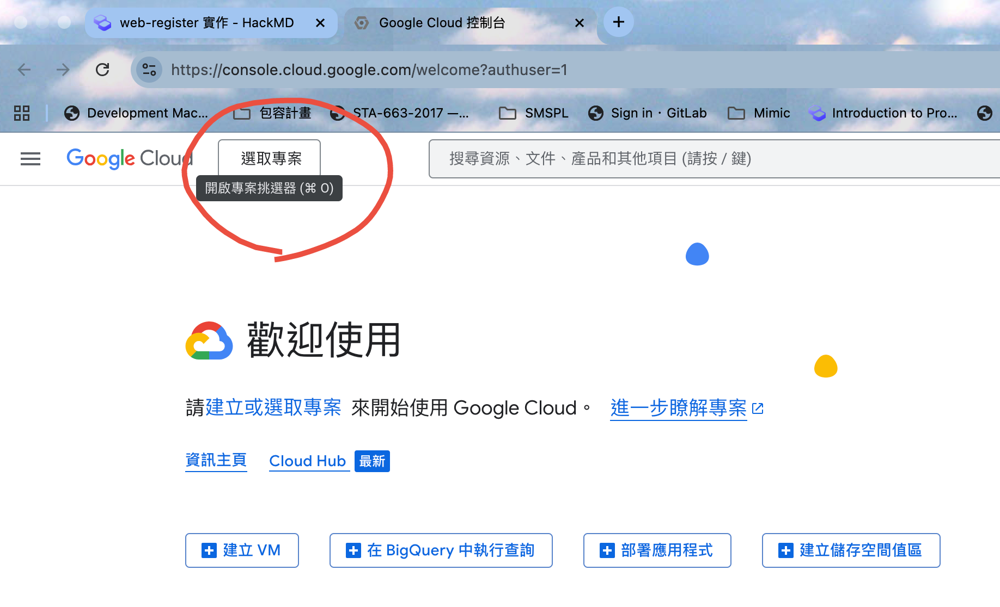
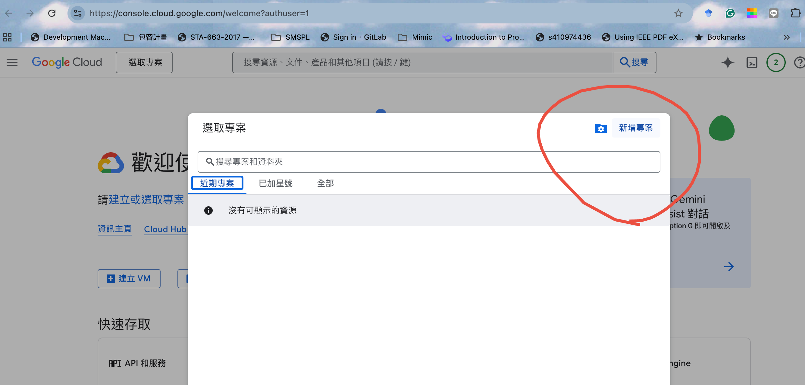
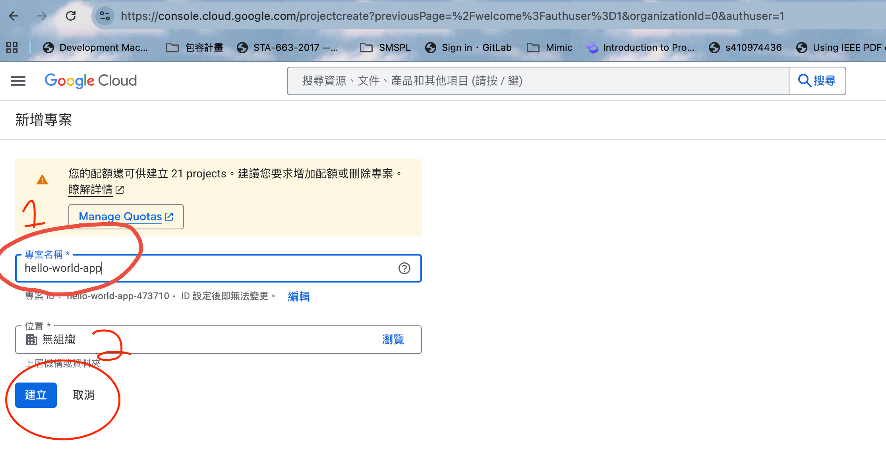
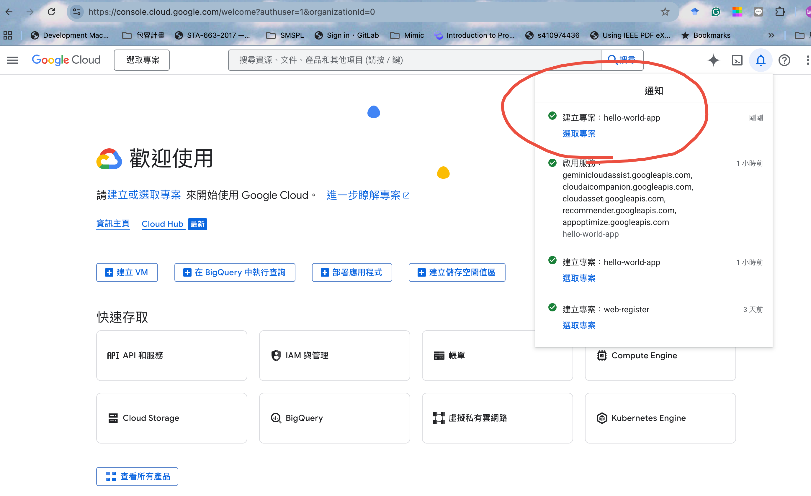
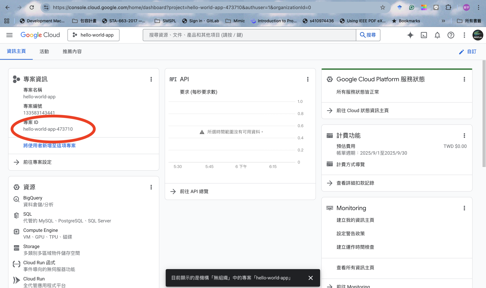

# Windows 全流程：安裝 Node 工具 → 本地跑一次 → 安裝雲端工具 → 設定 GCP → 部署 Hello World 到 Cloud Run

> **本教學適合完全沒用過 GCP 或 Cloud Run 的初學者。每一步都附註解，請照順序操作。**

---

## 1) 安裝 Node 工具
- **Node.js（含 npm）**：用來寫和執行 JavaScript 程式。  
  前往 https://nodejs.org/ 下載 LTS 版，安裝後在終端機輸入 `node -v` / `npm -v` 檢查是否安裝成功。
- **注意事項：**  
  如果你在 PowerShell 執行 `npm` 指令時出現「未經數位簽署」或「無法載入 npm.ps1」的錯誤，這是因為 PowerShell 預設有「執行原則」安全限制，為了防止惡意指令碼執行，會阻擋未簽署的指令碼（如 npm.ps1）。  
  你可以用以下指令暫時允許執行 npm：

  ```powershell
  Set-ExecutionPolicy -Scope CurrentUser -ExecutionPolicy RemoteSigned
  ```
  執行後，請重新開啟 PowerShell，再試一次 `npm -v`。  
  這樣就能正常使用 npm 指令了。  
  > **補充說明：**  
  > RemoteSigned 代表本機建立的指令碼可以執行，從網路下載的則需要有簽章。這是微軟用來保護使用者的機制，初學者只要照上述步驟設定即可安全使用 npm。

---

## 2) 本地跑一次

> **說明：**  
> 先在自己電腦上跑 Hello World，確定程式沒問題再部署到雲端。

```powershell
cd hello-world-app
# 進入你的 app 資料夾（請確認有 server.js 檔案）

npm install express
# 安裝 express 套件（Node.js 最常用的網頁伺服器）

node .\server.js
# 如果你是在 PowerShell 執行，請用 .\server.js（有 .\）
# 如果你是在 cmd（命令提示字元）執行，請用 node server.js（不用 .\）
```
> **小提醒：**  
> PowerShell 需要加上 `.\` 來指定目前資料夾的檔案，而 cmd 則直接輸入檔名即可。  
> 如果瀏覽器打不開 http://localhost:3000 ，請檢查 server.js 是否有設定正確的 PORT。

---

### （進階）本地用 Docker 跑 Hello World

> 如果你已安裝 [Docker Desktop](https://www.docker.com/products/docker-desktop/)，可以直接用 hello-world-app 資料夾下的 Dockerfile 來測試。

1. **建置 Docker 映像檔**  
   在終端機進入 `hello-world-app` 資料夾，執行：

   ```powershell
   docker build -t hello-world-app .
   ```

2. **啟動容器**  
   執行：

   ```powershell
   docker run -p 3000:3000 hello-world-app
   ```

3. **測試**  
   打開瀏覽器，輸入 [http://localhost:3000](http://localhost:3000) 應該能看到 Hello World 頁面。

> **補充說明：**  
> - `docker build` 會根據 Dockerfile 建立映像檔。  
> - `docker run -p 3000:3000` 會把本機的 3000 port 映射到容器的 3000 port。  
> - 若要停止容器，按下 `Ctrl+C` 或用 `docker ps` 查詢容器 ID，再用 `docker stop <CONTAINER_ID>` 停止。

---

## 3) 安裝雲端工具

- **Google Cloud SDK（gcloud）**：用來操作 Google Cloud 的指令工具。  
  前往 https://cloud.google.com/sdk/docs/install 下載 Windows Installer。  
  安裝時請勾選「Add gcloud to PATH」（讓你在任何資料夾都能用 gcloud 指令）與「Run gcloud init after installation」（安裝完自動初始化）。


---

## 4) 設定 GCP 專案與 API

> **說明：**  
> GCP（Google Cloud Platform）需要先登入帳號、選定專案，並啟用 Cloud Run 相關 API。

1. **登入 GCP 並新增專案**  
   - 使用自己的 Gmail 帳號登入 [Google Cloud Console](https://console.cloud.google.com/)  
   - 點選左上角「選取專案」下拉選單，選擇「新增專案」  
   - 專案名稱請輸入 `hello-world-app`，建立完成後記下你的專案 ID

   <!-- 以下插入 assets/images 目錄下的圖檔，依檔名第一個數字排序 -->

   
   > 步驟1：登入 Google Cloud Console 後，點選左上角「選取專案」下拉選單，準備新增專案。

   
   > 步驟2：在專案選單中，點選「新增專案」按鈕，開始建立新專案。

   
   > 步驟3：輸入專案名稱（建議用 `hello-world-app`），然後按下「建立」。

   
   > 步驟4：建立完成後，回到專案選單，選取剛剛建立的 `hello-world-app` 專案。

   
   > 步驟5：確認已切換到新專案，並記下專案 ID（後續 gcloud 指令會用到）。
   

2. **在終端機設定 gcloud 工具**  

   `gcloud init` 是 Google Cloud SDK 的初始化指令，用來設定你的帳號、專案與預設區域。執行後會出現互動式選單，讓你：

   - 登入 Google 帳號（會開啟瀏覽器要求授權）
   - 選擇或建立 GCP 專案
   - 設定預設區域（如 asia-east1）

   > 建議第一次安裝完 gcloud 時就執行一次 `gcloud init`，確保所有設定都正確。

   ```powershell
   gcloud init
   ```
   
   ```powershell
   gcloud auth login
   # 登入 Google 帳號，授權 gcloud 工具

   gcloud config set project <你的專案 ID>
   # 設定你要操作的 GCP 專案，請用自己的專案 ID 取代 <你的專案 ID>

   gcloud config set run/region asia-east1
   # 設定 Cloud Run 預設部署區域（台灣）

   gcloud services enable run.googleapis.com cloudbuild.googleapis.com artifactregistry.googleapis.com
   # 啟用 Cloud Run、Cloud Build、Artifact Registry 這三個服務
   ```
   > **小提醒：**  
   > 如果不知道自己的專案 ID，可以到 GCP 控制台首頁左上角找到。

---

## 5) 由雲端建置並部署 Cloud Run

> **說明：**  
> 這步會把你的程式打包成 Docker 容器，推到 GCP 的 Artifact Registry，再部署到 Cloud Run。  
> **請注意：終端機要切換到「看得到 `hello-world-app` 這個資料夾」的路徑下（也就是專案根目錄），而不是進入 `hello-world-app` 資料夾裡。**
> 例如，如果你的專案結構是：
>
> ```
> /Users/你的帳號/Workplace/hello-world-teaching-kit/
> └── hello-world-app/
> ```
>
> 請在 `/Users/你的帳號/Workplace/hello-world-teaching-kit/` 這個路徑下執行指令。
>
> 這樣 `gcloud builds submit --tag ... ./hello-world-app` 才能正確找到 `hello-world-app` 資料夾與 Dockerfile。

請務必確認你的終端機當前路徑是專案根目錄，然後再依序執行以下指令：

---

### 步驟一：建立 Artifact Registry（只需做一次）

Artifact Registry 是用來儲存 Docker 映像檔的雲端倉庫。第一次部署前，先建立一個 repository：

```powershell
gcloud artifacts repositories create hello-repo --repository-format=docker --location=asia-east1
```
- `hello-repo`：你要建立的倉庫名稱，可以自訂
- `--repository-format=docker`：指定這個倉庫用來存放 Docker 映像檔
- `--location=asia-east1`：指定倉庫建立在台灣區域（asia-east1）

> 如果已建立過，可以跳過這步。

---

### 步驟二：用 Cloud Build 建置 Docker 映像並推送到 Artifact Registry

這個指令會自動讀取 `hello-world-app` 資料夾下的 Dockerfile，建置出 Docker 映像檔並推送到你剛剛建立的 hello-repo。

```powershell
gcloud builds submit --tag asia-east1-docker.pkg.dev/<你的專案 ID>/hello-repo/hello-world-app:latest ./hello-world-app
```
- `gcloud builds submit`：用 Cloud Build 服務建置 Docker 映像檔
- `--tag`：指定建置完成後要推送到哪個 Artifact Registry 路徑
  - `asia-east1-docker.pkg.dev/<你的專案 ID>/hello-repo/hello-world-app:latest`
    - `asia-east1-docker.pkg.dev`：台灣區域的 Artifact Registry 網域
    - `<你的專案 ID>`：你的 GCP 專案 ID（請自行替換）
    - `hello-repo`：剛剛建立的倉庫名稱
    - `hello-world-app:latest`：映像檔名稱與標籤（latest 代表最新版）
- `./hello-world-app`：指定要建置的程式碼資料夾（這裡就是 hello-world-app）

---

### 步驟三：部署到 Cloud Run（公開）

這個指令會把剛剛推送到 Artifact Registry 的映像檔部署到 Cloud Run，並開放所有人都能存取（--allow-unauthenticated）。

```powershell
gcloud run deploy hello-world-app \
  --image asia-east1-docker.pkg.dev/<你的專案 ID>/hello-repo/hello-world-app:latest \
  --allow-unauthenticated \
  --region asia-east1
```
- `gcloud run deploy hello-world-app`：部署一個名為 hello-world-app 的 Cloud Run 服務
- `--image`：指定要部署的 Docker 映像檔路徑（就是上一步推送的路徑）
- `--allow-unauthenticated`：允許所有人（不需登入）都能存取這個服務
- `--region asia-east1`：指定部署在台灣區域

---

### 部署成功後

終端機會顯示一個 HTTPS 連結，點開就能看到 Hello World！

---

## 6) 如何停止 Cloud Run 服務

如果你不需要這個服務，或想釋放資源，可以用以下指令將 Cloud Run 服務移除：

```powershell
gcloud run services delete hello-world-app --region asia-east1
```

> 執行後，該服務會從 Cloud Run 移除，網址也會失效。  
> 如果只是暫停流量，也可以在 GCP 控制台設定 IAM 權限或流量分配。

---

## 7) 如何登出 gcloud 帳號

如果你想取消本機的 gcloud 登入授權，可以在終端機執行：

```powershell
gcloud auth revoke
```

> 執行後，gcloud 會登出目前的 Google 帳號，移除本機授權。

---

## 8) 下一步

- 看 `README-COLLAB.md` 學習如何設定 GitHub 與另一位開發者協作
- 若要正式部署，建議改用 `WIF-SETUP.md` 的無金鑰方案，更安全

---

## 2-1) 加入註冊網站功能（Node.js + Express + Firebase）

> 本段教你如何讓 Hello World 網站支援「註冊帳號」功能，並將帳號資料存到 Firebase Authentication。  
> 適合初學者，步驟詳細，請照順序操作。

---

### 步驟 1：啟用 Firebase Authentication

1. 前往 [Firebase Console](https://console.firebase.google.com/)，選擇你的專案。
2. 點選左側「Authentication」→「Sign-in method」。
3. 啟用「Email/Password」登入方式。

---

### 步驟 2：下載 Firebase 服務帳號金鑰

1. 前往 [Google Cloud Console](https://console.cloud.google.com/)（選擇你的 Firebase 專案）。
2. 左側選單點「IAM 與管理員」→「服務帳號」。
3. 找到名稱包含 `firebase-adminsdk` 的服務帳號（沒有就建立一個）。
4. 點右側「動作」(⋮) →「管理金鑰」→「新增金鑰」→ 選擇「JSON」→ 按「建立」。
5. 下載下來的檔案（如 `serviceAccountKey.json`），請放到 `hello-world-app/` 資料夾內。

> **安全提醒：**  
> 請勿將金鑰檔上傳到公開的 GitHub repository，建議將其加入 `.gitignore`。

---

### 步驟 3：安裝必要套件

在 `hello-world-app` 資料夾下，打開終端機執行：

```bash
npm install express firebase-admin nodemailer dotenv
```

---

### 步驟 4：修改 server.js，加入註冊功能

將 `hello-world-app/server.js` 修改如下（或依下方片段補上註冊功能）：

```javascript
// ===============================
// 教學版 server.js（超詳細中文註解）
// 技術：Node.js + Express + Firebase Admin SDK
// 目標：提供三個主要功能：
//   1) GET /        -> 顯示 Hello World 首頁 (HTML)
//   2) GET /health  -> 健康檢查端點（給 Cloud Run / 負載平衡器探測用）
//   3) 註冊頁面與註冊表單處理（用 Firebase 建立帳號）
// ===============================

const express = require('express');
const admin = require('firebase-admin');

// 載入 Firebase 服務帳號金鑰
const serviceAccount = require('./serviceAccountKey.json'); // 檔名依你下載的為主

// 初始化 Firebase Admin
admin.initializeApp({
  credential: admin.credential.cert(serviceAccount)
});

const app = express();
app.use(express.urlencoded({ extended: true }));

// 首頁
app.get('/', (req, res) => {
  res.send(`
    <h1>Hello World!</h1>
    <p>這是首頁。</p>
    <a href="/register">註冊帳號</a>
  `);
});

// 健康檢查
app.get('/health', (req, res) => {
  res.status(200).send('OK');
});

// 註冊頁面（GET）
app.get('/register', (req, res) => {
  res.send(`
    <h1>註冊帳號</h1>
    <form method="POST" action="/register">
      <label>帳號（Email）：<input type="email" name="username" required></label><br>
      <label>密碼：<input type="password" name="password" required></label><br>
      <button type="submit">註冊</button>
    </form>
    <a href="/">回首頁</a>
  `);
});

// 處理註冊表單（POST）：用 Firebase 建立新帳號
app.post('/register', async (req, res) => {
  const { username, password } = req.body;
  try {
    // 用 Firebase Admin 建立新使用者
    const userRecord = await admin.auth().createUser({
      email: username,
      password: password
    });
    res.send(`
      <h2>註冊成功！</h2>
      <p>帳號（Email）：${userRecord.email}</p>
      <a href="/">回首頁</a>
    `);
  } catch (error) {
    // 錯誤處理（如帳號已存在、密碼不符規則等）
    res.send(`
      <h2>註冊失敗</h2>
      <p>錯誤訊息：${error.message}</p>
      <a href="/register">回註冊頁</a>
    `);
  }
});

// 決定伺服器監聽的埠號
const PORT = process.env.PORT || 3000;
app.listen(PORT, () => {
  console.log(`Listening on port ${PORT}`);
});
```

---

### 步驟 5：本地測試

1. 在 `hello-world-app` 資料夾下執行：
   ```bash
   node server.js
   ```
2. 打開瀏覽器，前往 [http://localhost:3000](http://localhost:3000)
3. 點選「註冊帳號」，填寫 Email 與密碼，測試註冊功能。

---

### 常見問題 Q&A

- **Q：註冊失敗，顯示找不到金鑰或權限錯誤？**  
  A：請確認 `serviceAccountKey.json` 檔案已放在 `hello-world-app/`，且檔名正確。

- **Q：密碼有什麼限制？**  
  A：Firebase 預設密碼需至少 6 字元。

- **Q：如何在 Firebase 後台看到註冊的帳號？**  
  A：到 Firebase Console → Authentication → Users，可以看到所有已註冊帳號。

---

> 完成以上步驟，你的 Hello World 網站就支援註冊功能，並能將帳號資料安全存到 Firebase Authentication！

---

> **常見問題 Q&A：**
> - 如果遇到權限錯誤，請確認 GCP 帳號有「Cloud Run 管理員」角色。
> - 如果部署失敗，請檢查專案 ID、區域、API 是否都啟用。
> - Windows 指令如果出錯，請確認有用 PowerShell 或 CMD 執行。

---

> **補充：什麼是 Cloud Build？**  
> Cloud Build 是 Google Cloud 的自動建置服務，可以幫你把原始程式碼（例如 Node.js 專案）自動打包成 Docker 容器映像檔。  
>  
> 在本教學流程裡，你會用 `gcloud builds submit` 指令，讓 Cloud Build 幫你讀取 `hello-world-app` 資料夾下的 Dockerfile，建置出 Docker 映像檔，並自動推送到 Artifact Registry。  
>  
> **簡單來說：**  
> - Cloud Build 就像「雲端打包機器」，幫你把程式變成可部署的容器。
> - 支援多種語言和建置流程，適合 CI/CD 自動化部署。
> - 想了解細節，請參考 [Cloud Build 官方說明](https://cloud.google.com/build/docs/overview)

---

> **補充：什麼是 Artifact Registry？**  
> Artifact Registry 是 Google Cloud 提供的「雲端儲存空間」，專門用來存放軟體建置出來的檔案（例如 Docker 容器映像檔、套件、程式庫等）。  
>  
> 在這個流程裡，當你用 Cloud Build 建好 Docker 容器後，這個容器會先被上傳到 Artifact Registry。Cloud Run 服務會從這裡抓取你的容器，然後在雲端啟動你的應用程式。  
>  
> **簡單來說：**  
> - Artifact Registry 就像「雲端倉庫」，幫你安全管理和分享建置好的程式檔案。  
> - 你可以在 GCP 控制台裡看到所有已上傳的映像檔，也能設定權限，決定誰可以存取。  
> - 這步驟是自動化部署流程中不可或缺的一環。
> - 想了解細節，請進一步看 [Artifact Registry overview](https://cloud.google.com/artifact-registry/docs?_gl=1*1afdyt8*_up*MQ..&gclid=CjwKCAjwuePGBhBZEiwAIGCVS6S22IgWd31LvF6vN_tSVeKjztDj3lWj4okQW1gv5NMZyPHAVw5ZoRoC_rsQAvD_BwE&gclsrc=aw.ds)

---

> **補充：什麼是 Cloud Run？**  
> Cloud Run 是 Google Cloud 的「無伺服器」容器執行平台，可以直接把 Docker 容器部署到雲端，讓你的程式自動擴展、公開給全世界存取。  
>  
> 在本教學流程裡，你會用 `gcloud run deploy` 指令，把剛剛建好的 Docker 映像檔部署到 Cloud Run，並取得一個 HTTPS 網址。  
>  
> **簡單來說：**  
> - Cloud Run 幫你「雲端啟動」容器，不用自己架伺服器。
> - 支援自動擴展、流量管理、IAM 權限控管。
> - 想了解細節，請參考 [Cloud Run 官方說明](https://cloud.google.com/run/docs/overview)
